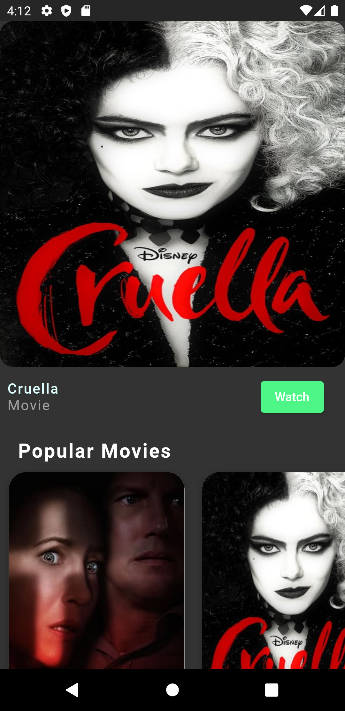
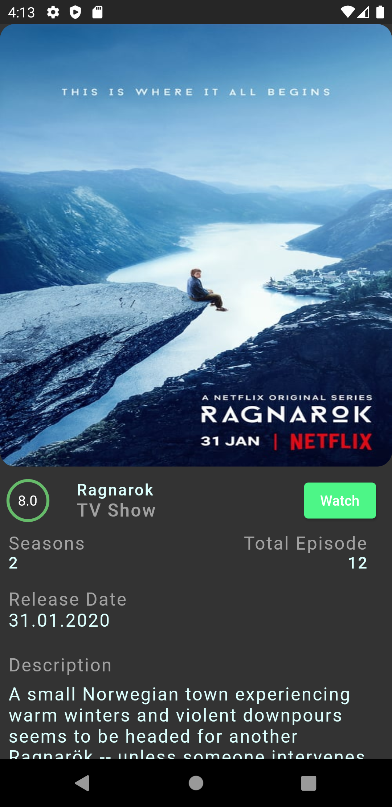

# Movies and Shows
   

A Flutter application aims to display popular movies and tv shows. Information about movies and tv shows provided by The Movie Database.

## Technologies
 * **GetX: 4.1.4**
 * **Lottie: 1.0.1**
 * **Crashlytics: 2.0.6**
 * **Intl: 0.13.3**

## Screenshots
                  
Splash Screen  | Home Screen |  **Trailer Display**
:--: | :--: | :--:
  |  | 

**Movie Detail** |  **Tv Show Detail**
:--: | :--: 
  | 

